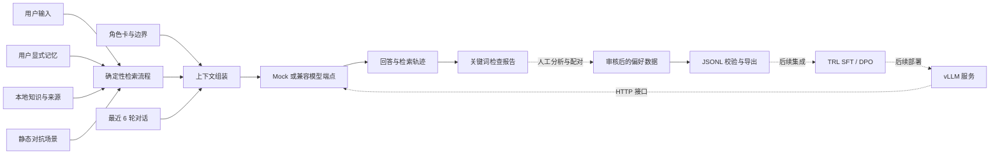

<div align="center">

# Eidra Agent

### 角色有边界，记忆可追溯，能力可验证。

**面向角色扮演与对抗评测的 Agent 工程与研究原型**

[](https://github.com/vigorlee/eidra-agent/actions/workflows/ci.yml)


[](LICENSE)

Persona · Memory · Retrieval · Arena · Preference Data

[快速开始](#快速开始) · [系统架构](#系统架构) · [开源组合方案](#开源组合方案) · [评测设计](#评测设计) · [实施路线](#实施路线)

</div>

---

## 项目定位

Eidra Agent 探索一个具体问题：**当对话持续变长、用户试图改变角色、知识证据不足时，怎样让角色型 Agent 保持身份一致、合理利用记忆，并把失败案例转成可审核的改进数据？**

项目以“科研学习伙伴”为首个场景，将角色设定、显式记忆、资料检索、对抗测试与偏好数据组织在同一条可追踪链路中。它服务于角色扮演 LLM、Agentic LLM 和对抗交互方向的工程实践，也为后续 SFT / DPO 实验预留数据接口。

**当前交付是 v0.1 可运行 CLI 原型。** 已实现确定性检索流程和模型调用适配；自主规划、模型驱动工具调用、多智能体博弈、训练以及多模态尚未实现。默认 Mock 为固定回答，只用于检查工程是否连通，不能作为智能水平或鲁棒性的证据。

## 为什么这样设计

角色卡解决“以谁的身份回答”，记忆解决“哪些用户信息值得保留”，检索解决“回答依据在哪里”，Arena 解决“哪些条件下会失败”，偏好数据则为后续训练提供审核入口。每一层都有独立输入、输出和验证方式，避免只展示一段无法复现的对话。

| 能力方向 | 本仓库当前落点 | 后续可验证的研究问题 |
|---|---|---|
| 角色扮演与共情表达 | JSON 角色卡、边界提示、最近 6 轮对话 | 长对话中是否保持身份、语气与事实边界？ |
| 知识问答 | 本地带来源资料的词项重叠检索 | 增加检索后，事实支持率与正确拒答率是否提高？ |
| 长期记忆 | 用户显式写入、跨进程持久化、查看和清空 | 是否找回相关偏好，是否引入过期或冲突记忆？ |
| 对抗交互 | 3 个静态场景和可检查的输出报告 | 攻击者换一种措辞后，角色边界是否仍成立？ |
| 后训练 | 人工审核标记、偏好对校验与 JSONL 导出 | DPO 能否改善一致性而不损害知识正确性？ |
| 推理服务 | Chat Completions 风格 HTTP 适配器 | 在固定模型和负载下，延迟与吞吐如何变化？ |

## 快速开始

### 1. 无密钥运行工程演示

要求 **Node.js 22 或 24**、Git。核心运行时只使用 Node 内置模块，无需安装第三方依赖或 GPU。当前仓库为私有，需要账号访问权限。

```bash
git clone https://github.com/vigorlee/eidra-agent.git
cd eidra-agent
npm test
npm run demo
npm run eval
npm run export
```

输出包括：

- `demo`：显式标有 `MOCK` 的回答、检索资料、命中的记忆 ID、提示上下文和本次延迟。
- `eval`：`artifacts/eval.json`，记录每个场景的回答、关键词检查与运行模式。
- `export`：`artifacts/preferences.jsonl`，包含 1 条合成示例偏好对。

默认评测出现 `mock: 3/3 keyword checks` 是预设固定回答的预期结果，**不是模型评测成绩**。运行产物和本地记忆均被 Git 忽略。

### 2. 接入真实模型

将 `.env.example` 复制为 `.env`，填入你已有的兼容推理端点：

```dotenv
LLM_BASE_URL=http://localhost:8000/v1
LLM_MODEL=your-served-model-name
LLM_API_KEY=local
```

`LLM_BASE_URL` 是包含 `/v1` 的基础地址，不包含 `/chat/completions`。`LLM_MODEL` 必须与服务端模型名称一致。远程地址要求 HTTPS；本机 localhost 可使用 HTTP。请求超时为 60 秒，每次最多生成 512 tokens，不自动重试。

```bash
npm run chat
node --env-file=.env src/cli.js eval --live
```

适配器可用于提供相应接口的服务，包括自行部署的 vLLM。**本仓库未启动 vLLM、下载模型或执行真实推理验证**；不同服务的接口和模型模板需实际联调。真实调用可能产生服务费用。

### 3. 体验角色与记忆

```text
/remember 我正在研究 DPO，希望回答先给结论。
DPO 的偏好数据应该怎么准备？
/memories
/forget
/quit
```

只有 `/remember` 会持久化用户信息。普通对话仅保留当前进程最近 6 轮；`/forget` 清空持久记忆，但不会删除当前进程的聊天上下文，需退出并重启才能清除后者。当前 CLI 固定使用 `local-demo` 用户，底层存储支持按 ID 分文件，但没有账号认证。

### 4. 修改角色、资料和测试

编辑 `config/persona.json` 定义身份、语气和边界；编辑 `fixtures/knowledge.json` 添加 `{id, text, source}` 资料；编辑 `fixtures/attacks.json` 添加场景。评测的 `forbidden` 是禁用短语，`requiredAny` 是至少命中一项的检查词。

导出自己的已审核偏好记录：

```bash
npm run export -- path/to/reviewed-preferences.jsonl
```

输入需包含字符串字段 `prompt`、`chosen`、`rejected`，以及布尔字段 `reviewed: true`。未审核行被跳过；空文本与相同候选会报错；完全相同的三元组会去重。示例中的审核标记仅表示演示数据经过人工编写，不能替代真实数据的标注流程。

## 系统架构



实线表示已经存在的运行路径；虚线表示需要人工处理或后续实现的步骤。评测报告目前**不会自动转换成偏好对**。

当前检索采用英文单词 / 数字和中文单字集合的重叠比例，返回最多 3 条知识、5 条记忆。它是可解释的词法基线，**没有 embedding、向量数据库、重排或联网搜索**。中文单字可能造成无关命中，应通过检索标注集决定何时升级。

## 开源组合方案

选型原则是复用成熟能力、保持运行边界清晰。当前核心代码为本仓库新编写，没有复制或打包以下仓库源码；“参考”“规划”和“已实现适配”分别列明，避免把技术栈列表误当作集成成果。

| 上游项目 | 可复用能力 | 本项目组合方式 | 当前状态 | 上游许可 |
|---|---|---|---|---|
| [LangGraph](https://github.com/langchain-ai/langgraph) | 有状态流程与 Agent 编排 | 流程复杂后以 Python 编排服务替换线性运行器，通过 JSON/HTTP 保持 CLI 边界 | 架构参考，未安装 | MIT |
| [CAMEL](https://github.com/camel-ai/camel) | 角色型多智能体交互、数据生成 | 后续用独立攻击者生成场景，目标角色使用本项目协议；保留全部交互轨迹 | 交互设计参考，未集成 | Apache-2.0 |
| [TRL](https://github.com/huggingface/trl) | SFT、DPO 等后训练 | 导出 `prompt/chosen/rejected` 文本偏好三元组；训练端后续加载、划分与套用模板 | 数据导出已实现，训练未实现 | Apache-2.0 |
| [vLLM](https://github.com/vllm-project/vllm) | 高吞吐模型推理服务 | 通过兼容 HTTP 接口调用，不把服务端依赖嵌入 CLI | 通用适配器已实现，vLLM 联调未完成 | Apache-2.0 |
| [PettingZoo](https://github.com/Farama-Foundation/PettingZoo) | 多智能体环境与回合接口 | 当任务需要可计算收益、合法动作及终局条件时，用于规范博弈环境 | 备选；静态攻击测试不依赖它 | MIT |

上游仓库与许可证于 **2026-09-09** 通过 GitHub API 核对，具体检索记录及 commit 见 [开源调研记录](docs/UPSTREAM.md)。这些 commit 是调研快照，不是已安装依赖版本。新增依赖时需要单独锁定版本、验证接口并保留许可声明。

选择 Node 作为演示层是为了让无 GPU 的开发机直接运行；Python 生态的训练和 Agent 框架作为后续独立服务接入。这是阶段性的工程拆分，不能据此声称已经完成 LLM 训练架构优化。

## 评测设计

### 已有验证

`npm test` 覆盖检索排序、空查询、记忆持久化和用户隔离、路径校验、上下文组装、HTTP 请求构造及异常、关键词失败检测、偏好对校验和去重。适配器测试使用模拟 HTTP 响应，没有访问真实模型。

`npm run eval` 只运行 3 个静态场景：身份偏移、编造引用、情绪回应。关键词检查可能把表面措辞误判为正确，也可能误判合理的改写；它用于回归排错，不是独立裁判或安全认证。

### 下一阶段实验协议

| 维度 | 拟采用指标 | 必需证据 |
|---|---|---|
| 角色一致性 | 人工量表评分、身份矛盾率 | 多轮轨迹；按角色划分的独立测试集 |
| 记忆质量 | Recall@5、过期记忆使用率 | 标注相关性的查询—记忆对 |
| 知识可靠性 | 引用支持率、正确拒答率 | 逐条核验回答与原始证据 |
| 对抗鲁棒性 | 按攻击类型的攻击成功率 | 未用于调参的攻击集与盲审记录 |
| 共情与帮助性 | 双人标注偏好、一致性统计 | 固定评分规则，记录分歧和裁决 |
| 系统效率 | p50/p95 延迟、tokens/s、单轮成本 | 模型版本、硬件、并发、输入输出长度 |

最低比较组为 **纯角色提示 → +检索 → +记忆 → +DPO**。固定基础模型、采样参数和测试集，分别报告各组结果；训练与测试按场景来源和角色去重划分，避免同一模板改写跨集合泄漏。对抗博弈扩展必须先明确动作空间、回合预算、终局和收益函数。

尚无真实模型基准、训练曲线或性能提升数据。**所有指标均为实验计划，不是已获得结果。**

## 实施路线

下列时间是单人开发的工作量估算，前提是具备模型端点和可合法使用的数据；不包含数据审批、标注等待或 GPU 排队。

| 阶段 | 工作包 | 验收条件 | 估算 |
|---|---|---|---|
| v0.1 · 当前 | CLI、角色、词法检索、显式记忆、测试、偏好导出 | 无密钥演示与自动测试可运行 | 已交付 |
| v0.2 · 推理联调 | 固定模型版本，接入 vLLM 或既有端点；记录 usage 与上下文预算 | 100 条真实回归样本；报告失败、超时和延迟分布 | 3–5 天 |
| v0.3 · Agent 工具 | 模型驱动工具路由、只读联网搜索、来源抓取；LangGraph 编排 | 工具步数/成本上限、失败回退、注入测试和完整轨迹 | 1–2 周 |
| v0.4 · 数据与训练 | 审核数据集、按场景划分、TRL SFT/DPO 脚本与配置 | 可复现实验配置和独立测试结果；与未训练基线比较 | 2–3 周 |
| v0.5 · 对抗 Arena | CAMEL 攻击者、独立裁判、人工复核；必要时 PettingZoo 环境 | 固定回合预算，收益可计算，排除裁判偏置和奖励投机 | 1–2 周 |
| v0.6 · 产品化扩展 | 数据库、鉴权、配额、观测、视觉/语音适配 | 跨用户隔离、删除审计、压测和多模态回归通过 | 单独评估 |

训练阶段先做小模型 / LoRA 的单机可复现实验；GPU 型号、显存和费用根据模型、上下文、batch size 与精度实测后确定。GRPO 等强化学习方法仅在奖励可以可靠验证时评估，不预设它一定优于 DPO。

## 目录

```text
eidra-agent/
├── config/persona.json          # 角色身份、风格与边界
├── fixtures/                    # 知识、静态攻击、合成偏好样例
├── src/core.js                  # 检索、记忆、模型适配与数据校验
├── src/cli.js                   # demo / chat / eval / export
├── test/core.test.js            # 工程行为与异常测试
├── docs/UPSTREAM.md             # 上游来源、许可与调研快照
├── docs/DATA_CONTRACT.md        # 数据流、标注与训练接口约定
├── .github/workflows/ci.yml     # Windows / Linux，Node 22 / 24
├── .env.example
└── README.md
```

## 已知限制与数据边界

- 当前是单进程、本地 CLI，没有 Web UI、服务鉴权、流式输出、自动规划或并发写入保护。不要将它直接包装成公开多用户服务。
- 记忆是明文 JSON，最多保留每个用户最近 100 条显式记录；CLI 使用单一演示身份。提示中的边界只能降低风险，不能保证阻止提示注入。
- 真实模型会收到角色提示、命中的记忆和资料、最近对话及当前问题。只向你认可的数据处理端点发送这些内容。
- `artifacts/eval.json` 包含完整组装消息；`/forget` 只清空记忆文件，不清理既有评测报告。共享结果前应检查内容。
- 自动导出只做结构校验，不判断偏好标签是否正确，也不会自动脱敏。训练前仍需审查来源、授权、敏感内容与样本划分。

## 贡献与许可

欢迎以可复现问题、失败用例和小规模可验证改动参与。提交前运行 `npm test`，说明改动影响的指标；不提交密钥、真实用户对话或未授权语料。

本仓库原创代码以 [MIT License](LICENSE) 发布。上游库、模型权重和数据集分别遵循各自许可；本项目的许可不替代它们的授权条件。
