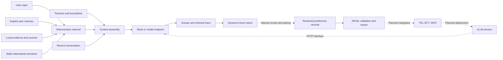

<div align="center">

# Eidra Agent

### Consistent personas. Traceable memory. Testable behavior.

**An engineering prototype for persona agents, adversarial evaluation, and preference data.**

面向角色扮演、持久记忆与对抗评测的智能体原型。

[](https://github.com/vigorlee/eidra-agent/actions/workflows/ci.yml)


[](LICENSE)

Persona · Memory · Retrieval · Arena · Preference Data

[Quick Start](#quick-start) · [Architecture](#architecture) · [Open Source Strategy](#open-source-strategy) · [Evaluation](#evaluation) · [Roadmap](#roadmap)

</div>

---

## Overview

**How can a persona agent preserve its identity, use relevant memories, and turn interaction failures into reviewable improvement data?**

Eidra Agent explores this question through a research companion scenario. It brings configurable personas, explicit persistent memory, source-tagged retrieval, adversarial checks, and preference data export into one inspectable workflow.

The current release is a **runnable v0.1 CLI prototype**. It implements deterministic retrieval and a model endpoint adapter. Autonomous planning, model-directed tool use, multi-agent games, training, and multimodal interaction are roadmap items. The default mock returns a fixed response to verify the engineering workflow; it does not demonstrate model capability or robustness.

## Capabilities

| Area | Available in v0.1 | Research direction |
|---|---|---|
| Persona | JSON identity, style, and boundaries; six recent conversation turns | Consistency across extended interactions |
| Retrieval | Lexical retrieval over local records with source identifiers | Evidence support and appropriate abstention |
| Memory | Explicit writes, persistence across restarts, inspection, and clearing | Relevant recall and stale-memory handling |
| Arena | Three static scenarios with inspectable keyword checks | Robustness against unseen attacks |
| Preference data | Review filtering, validation, exact deduplication, and JSONL export | Auditable datasets for SFT / DPO experiments |
| Model access | Chat Completions-style HTTP adapter | Integration with a fixed backend and measured workloads |

Each component has explicit inputs and outputs, making failures reproducible and future improvement claims measurable.

## Quick Start

### 1. Run without a model or API key

Requirements: **Node.js 22 or 24** and Git. The runtime uses only Node built-in modules; no third-party package installation or GPU is needed for the mock workflow.

```bash
git clone https://github.com/vigorlee/eidra-agent.git
cd eidra-agent
npm test
npm run demo
npm run eval
npm run export
```

| Command | Output |
|---|---|
| `npm run demo` | A marked `MOCK` answer, retrieved evidence, memory IDs, assembled messages, and elapsed time |
| `npm run eval` | `artifacts/eval.json` with scenario outputs, keyword checks, and execution mode |
| `npm run export` | `artifacts/preferences.jsonl` with one synthetic example pair |

The expected `mock: 3/3 keyword checks` result comes from a fixed response and is **not a model benchmark score**. Generated artifacts and local memory are excluded from Git.

The bundled persona, prompts, and evaluation fixtures are primarily Chinese. English examples below illustrate CLI usage; the configured persona may still answer in Chinese. Edit the persona and fixtures for English-language experiments.

### 2. Connect a model endpoint

Copy `.env.example` to `.env` and configure an existing compatible service:

```dotenv
LLM_BASE_URL=http://localhost:8000/v1
LLM_MODEL=your-served-model-name
LLM_API_KEY=local
```

Use the base URL including `/v1`, without `/chat/completions`. The model name must match the server configuration. Remote endpoints require HTTPS; local loopback endpoints may use HTTP. Requests have a 60-second timeout, a 512-token output limit, and no automatic retries.

```bash
npm run chat
node --env-file=.env src/cli.js eval --live
```

The adapter targets compatible services, including appropriately configured vLLM deployments. **No model has been downloaded, no vLLM server has been deployed, and no live inference validation has been performed for this release.** Provider compatibility and model templates need integration testing. Live requests may incur provider charges.

### 3. Use explicit memory

```text
/remember I am studying DPO and prefer concise explanations.
How should I prepare preference data for DPO?
/memories
/forget
/quit
```

Only `/remember` persists user information. Ordinary dialogue retains up to six recent turns in the current process. `/forget` clears persistent memory but not the active conversation history; exit and restart to clear that history.

The CLI uses the fixed `local-demo` identity. The underlying store separates files by user ID, but this is not an authentication system.

### 4. Customize inputs and export preferences

- `config/persona.json`: identity, style, and behavioral boundaries.
- `fixtures/knowledge.json`: evidence records with `id`, `text`, and `source`.
- `fixtures/attacks.json`: scenarios with forbidden phrases and at least one required phrase from `requiredAny`.

Export your own reviewed records:

```bash
npm run export -- path/to/reviewed-preferences.jsonl
```

Each input row must contain nonempty string fields `prompt`, `chosen`, and `rejected`, plus the boolean `reviewed: true`. Unreviewed rows are skipped; empty fields or identical candidates cause an error; identical triples are deduplicated. The synthetic fixture demonstrates the format and does not replace real annotation.

## Architecture



Solid edges represent implemented paths. Dashed edges require manual processing or future integration. Evaluation reports are **not automatically converted into preference pairs**.

Retrieval ranks records by token-set overlap using English words, numbers, and individual Chinese characters. Each turn selects up to three knowledge records and five memories. This lexical baseline has no embeddings, vector database, reranker, or web search. Character overlap can produce irrelevant matches; a labeled retrieval set should guide upgrades.

## Open Source Strategy

The current code was written for this repository and does not vendor or bundle the projects below. Design references, implemented interfaces, and planned integrations are distinguished explicitly.

| Project | Relevant capability | Intended role and current status | Upstream license |
|---|---|---|---|
| [LangGraph](https://github.com/langchain-ai/langgraph) | Stateful agent orchestration | Future Python orchestration service behind JSON/HTTP; architecture reference, not installed | MIT |
| [CAMEL](https://github.com/camel-ai/camel) | Role-based multi-agent interaction | Future attacker agents and scenario generation; design reference, not integrated | Apache-2.0 |
| [TRL](https://github.com/huggingface/trl) | SFT, DPO, and other post-training methods | Reviewed preference triples are exported; training and templates are not implemented | Apache-2.0 |
| [vLLM](https://github.com/vllm-project/vllm) | High-throughput inference serving | Generic HTTP adapter implemented; vLLM integration not validated | Apache-2.0 |
| [PettingZoo](https://github.com/Farama-Foundation/PettingZoo) | Multi-agent environment interfaces | Optional future game environments with explicit actions, turns, and rewards | MIT |

Repository metadata and licenses were checked through the GitHub API on **2026-09-09**. The [upstream research record](docs/UPSTREAM.md) contains snapshot commits and sources and is currently in Chinese. These snapshots record research provenance, not installed dependency versions. Future integrations need version locks, interface tests, and license notices.

Node keeps the demonstration accessible without a GPU. Python-based training and orchestration are planned as separate services. This separation does not constitute an implemented training-system optimization.

## Evaluation

### Engineering validation

Seven automated tests cover retrieval, memory persistence and user isolation, path validation, context assembly, HTTP request construction and errors, keyword failure detection, preference validation and deduplication, and explicit mock labeling.

GitHub Actions runs tests and the demo, evaluation, and export commands across **Windows / Linux × Node.js 22 / 24**. Adapter tests use simulated HTTP responses rather than real models.

The current Arena contains three static scenarios: identity drift, fabricated citations, and emotional support. Keyword checks can reward superficial wording or reject valid paraphrases. They support regression debugging and are not an independent semantic judge or safety certification.

### Planned experimental protocol

| Dimension | Proposed metrics | Required evidence |
|---|---|---|
| Persona consistency | Human rubric scores; identity contradiction rate | Multi-turn traces and held-out personas |
| Memory quality | Recall@5; stale-memory usage rate | Labeled query–memory relevance pairs |
| Grounding | Citation support; appropriate abstention | Answer-level checks against original evidence |
| Adversarial robustness | Attack success rate by category | Held-out attacks and blinded review |
| Empathy and helpfulness | Human preference; annotator agreement | Fixed rubrics and recorded adjudication |
| Serving efficiency | p50/p95 latency; tokens/s; per-turn cost | Model version, hardware, concurrency, sequence lengths |

The minimum ablation sequence is **persona prompting → +retrieval → +memory → +DPO**. Hold the base model, decoding parameters, and test set fixed. Split data by persona and scenario origin and check for template leakage across training and evaluation sets.

An adversarial game extension must first define actions, turn budgets, termination, and rewards. **No live-model benchmark, training curve, or measured improvement is available yet.** These metrics are an experimental plan.

## Roadmap

Effort estimates assume one developer, an available endpoint, and appropriately licensed data. They exclude annotation delays, approvals, and GPU queue time.

| Milestone | Scope | Acceptance criteria | Estimated effort |
|---|---|---|---|
| **v0.1 — Available** | CLI, persona, retrieval, memory, tests, preference export | Keyless workflow and automated tests pass | Delivered |
| **v0.2 — Live inference** | Fix model revision; integrate endpoint; record usage and context budgets | 100 live regression cases with failure, timeout, and latency reports | 3–5 days |
| **v0.3 — Agent tools** | Model-directed routing, read-only web search, source retrieval, LangGraph | Step/cost limits, fallbacks, injection tests, complete traces | 1–2 weeks |
| **v0.4 — Post-training** | Reviewed dataset, scenario splits, TRL SFT/DPO scripts | Reproducible runs and held-out baseline comparisons | 2–3 weeks |
| **v0.5 — Adversarial Arena** | CAMEL attackers, independent judging, human review, optional game environment | Bounded interactions, computable rewards, judge-bias and reward-exploitation checks | 1–2 weeks |
| **v0.6 — Product extensions** | Database, authentication, quotas, observability, vision/audio | User isolation, deletion audits, load tests, multimodal regression | Scope separately |

Training should start with reproducible small-model or LoRA experiments. GPU requirements and cost must be measured for the chosen model, sequence length, batch size, and precision. Evaluate GRPO or other reinforcement-learning methods only when rewards can be reliably verified; they are not assumed to outperform DPO.

## Repository Layout

```text
eidra-agent/
├── config/persona.json         # Identity, style, and boundaries
├── fixtures/                   # Knowledge, attacks, synthetic preferences
├── src/core.js                 # Retrieval, memory, adapters, validation
├── src/cli.js                  # demo / chat / eval / export
├── test/core.test.js            # Behavioral and error-path tests
├── docs/UPSTREAM.md            # Research and license snapshots (Chinese)
├── docs/DATA_CONTRACT.md       # Data and training contracts (Chinese)
├── .github/workflows/ci.yml    # Windows / Linux, Node 22 / 24
├── .env.example
└── README.md
```

## Limitations and Data Handling

- This is a single-process local CLI without a web UI, authentication, streaming, autonomous planning, or concurrent-write protection. Public source availability does not make it a production multi-user service.
- Memory uses plaintext JSON and retains up to 100 explicit records per user. The CLI uses one demo identity. Prompt boundaries cannot guarantee resistance to prompt injection.
- Live inference sends persona instructions, retrieved memories and evidence, recent dialogue, and the current query to the configured endpoint. Choose a provider appropriate for that data.
- `artifacts/eval.json` contains assembled messages. `/forget` clears the memory file but not previous evaluation artifacts. Inspect artifacts before sharing.
- Export validates structure, not annotation quality, data rights, or sensitive content. Review provenance, permissions, privacy, and dataset splits before training. The [data contract](docs/DATA_CONTRACT.md), currently in Chinese, documents the format and planned review workflow.

## Contributing

Contributions are welcome as reproducible issues, failure cases, and focused improvements. Run `npm test` before submitting code changes and explain which behavior or metric they affect. Keep credentials, real user conversations, and unlicensed datasets out of commits.

## License

Original code is available under the [MIT License](LICENSE). Upstream libraries, model weights, and datasets retain their respective licenses; this project's license does not replace their terms.
